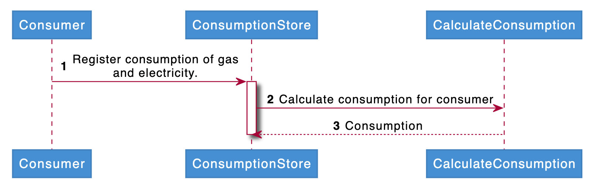

# Storytelling

Kobe Bryant, arguably one of the top ten basketball players to have ever
played the game, was a tremendous story teller. If you have ever seen
one of his interviews you'll know how much impact his words have had on
a generation of basketball players. Storytelling is what drives our
imagination; storytelling is what took our species from being tribes
trying to survive by gathering and hunting our food to a species on the
cusp of interplanetary space travel.

We, as a species, see patterns. Patterns to help us distinguish a snake
from a branch or patterns which help us detect early stage cancer from a
blurry black and white image covering a well lit background in a
doctor's office. Storytelling gives us a way to fill other people's
minds with discernible patterns and guide them to a realization which
had otherwise not occurred. A good story will help you communicate your
goals and your values, through a good narrative you can help everyone
work towards a common goal. Like with almost everything in life, a good
story is incredibly important when creating software. It is really hard
to get 200 developers to create functioning software without aligning
your goals, a good narrative is crucial to this endeavor.

This story is not about Kobe Bryant, this story is about how we as an
architecture community must focus on the *story* we are trying to tell.
Architects are very good at finding and exploring patterns, but a
pattern is not something we can convince someone of, or sell to the
business. A pattern is just that, a set of seeming similarities which
might be abstracted and given a name. A story is what brings the need
for these patterns to light. We should not skip the story, just so that
we can spoil the ending. This article will show you how our habits and
our tools cause us to miss most of the story and because of that,
deliver software which could be a lot better.

## Diagrams vs Story

One of our most important languages, as architects, is ArchiMate. We
tend to use it to tell our story. Our focus on ArchiMate and the tools
implementing the ArchiMate language, muddy the story which we are trying
to tell with our software. A diagram is not a story, a diagram might be
a picture used to bring a scenario to life, but it can never be the
story by itself.

The ArchiMate language is maintained by the Open Group. To quote the
Open Group's website: "The Open Group is a global consortium that
enables the achievement of business objectives through technology
standards." They publish a modeling language called *ArchiMate* which
can be used to generate consistent architecture diagrams. The following
definition of what the ArchiMate specification is can be found on their
website:

> The ArchiMate Specification provides a common language and elements to
enable enterprise, business, solution and technology architects,
business analysts and modelers, and software engineers to describe,
analyze, and visualize the relationships among business domains in an
unambiguous way - ArchiMate Open Group

If the goal of the Open Group is to enable us, to achieve business
objectives, then why do they not focus on storytelling? Are we to assume
that a diagram really triggers our imagination?
Let alone our understanding? Where have we described the business
objectives themselves so that others will understand what our diagram
describes? Where is the narrative supported by the diagram?

When we see an image like the Archimate example our brains go into
overdrive and we start looking for patterns. For some reason the yellow
blocks are at the top. Some seem to have more rounded corners than
others and still others seem to look 3d instead of being 2d. Wow, there
are different arrows.

ArchiMate tries to combat this natural reaction of our brains by setting
up rules and definitions. Like every intellectual worth their salt the
Open Group started whittling away at their problem space by writing down
what the arrows, icons and corners mean. From the entire set of
possibilities they defined their way to something they think is
reasonable. But what happens next? John, from upstairs, really needs a
*business capability* to be implemented through a certain *data object*
by a *component*, and before we realize it we have a committee bloating
our language with exceptions and clarifications.

This is, of course, an over-simplification of what happens; but the gist
stands, nothing in the ArchiMate language is axiomatic, everything
is an interpretation and because the storytelling surrounding the rules
put forth by the Open Group is lacking at best, we end up with a set of
rules people need to *learn by heart* in order to have a chance at
understanding the diagrams individuals create.

It is safe to assume that we now understand why none of the large
*tech-companies* bother using tools like *Archi* or *Enterprise
Architect* by Sparx, in their day to day development. Other types of
organizations still use these tools and as a consequence the gap between
architecture and development has never been bigger. To make matters
worse, every five years we get a paradigm which is a *silver bullet*. It
might be *Functional Programming* or it might be *Cloud*. It does not
matter if it is a framework, a language or an infrastructure. With a
lack of a common sense architecture we are faced with a plethora of
choices regarding our development strategies and the implementation of
our stories.

*Micro-services*, for example, are a way of thinking about a solution.
They are patterns, guidelines and best practices shared with us by
inventors. They are *tools* without a story. Not every story leads to a
*micro-service architecture* and not every story needs the *Interface
Segregation Principle*. It is true that once you are bringing your story
to life like a director bringing a play to the stage, you'll have a
certain freedom to choreograph your story. At the root of the
implementation, however, remains the story.

# Storytelling within Architecture

*Effective storytelling* will save us from the day to day chaos of large
enterprises; let me explain why, but like every good story we will need
to start at a beginning:

> As a consumer I would like to see how much electricity or gas I have
consumed in the last month. - Essent Customer

There, our story begins. There is no need for diagrams, there is no need
for rules or definitions, there is just plain language. With these
simple words our brains can start finding patters; we can start finding
truths within this statement and we can grow our understanding by
talking to other people and sharing our patterns and assumptions with
each other. Our tribal instincts can be met by human to human
interaction. This storytelling, at least for me, is at the heart of
*Domain Driven Design*. And I personally define a *Domain* as: "An area
of expertise I can fit into my brain."

But, how can we create software if we just *have a story*? We will need
something we can validate, we can test, we can deploy and which we can
take ownership of and maintain.

Yes, this is true, but we will need to crawl before we can walk and
we'll need to walk before we can run. A child needs to feel safe to get
the grounding they need to face the challenges of life. Software is the
same, if we do not feel safe in our assumptions, if we do not feel
confident in our skills and if we do not trust our architects to work
*with* us; we will never achieve the level of software we will need to
lift our business to a higher level.

## Start-ups vs Enterprises

Let us dive into a tangent; why do start-ups fail? And, why do certain
start-ups surpass larger enterprises? An *Enterprise* should have the
money to outlast the competition, right? An *Enterprise* should have the
money to look around, hire the best people and quickly integrate great
ideas into their own production, right? The answer lies in
*storytelling*. An *Enterprise* has hierarchy which means that the story
can become fragmented and corrupted. Within an *Enterprise* a lot of
focus and time is spent on *aligning ideas*, which is nothing more than:
"Getting your story straight."
When hierarchy comes into play, the story of someone does not fit the
overall narrative but is forced onto the narrative by reasons other than
cohesion. Hierarchy is used when the story needs to be changed but the
actors and actresses do not understand or sanction the changes. If it
were otherwise, the story would just unfold and there would be no need
for hierarchical decisions.

Start-ups are smaller, usually run by an *enlightened despot*. They have
a single narrative, a single story and everyone knows the story. There
is no ambiguity within the story, no doubt, no fragility and no
conflicting message; there is only the story. But, they do fail, a lot.
Just because the narrative is strong and unambiguous, does not mean that
the story is good or that the story is gripping. There are plenty of
books which I do not care to read but the ones which gripped me have
never left me.

## Our story continues...

From our story we can distill that we have concepts like: "consumption",
"electricity" and "consumer". These story concepts will need to find a
place in our architecture. If we follow the breadcrumbs left by our
story, we will start to figure out the sequence in which the *events* of
our story take place.

Our story starts with a *consumer*, *consuming*, *electricity* or *gas*.
In this part we set up the actors in our story, we describe how they
interact, what motivates our actors and what limits them. Clearly these
actors need something; or there would not be a story to write. Instead
of saying: "A consumer consumes electricity." we might write something
like: "Winter is coming! An unexpected cold front will hit our lovely
country with a fierceness which has been unparalleled for the last
twenty years. Anna feels the cold seep through her walls and turns on
her central heating which is powered by heating water through the
burning of gas. This heating consumes gas at an initial flow rate of
1/2m per hour. This of course is only in times when it is
cold. During the summer the consumption of gas might even drop to 0."
This story is starting to help us understand what "consumption" actually
is and why it is important for us to show it to Anna.

To further help us understand this *process* we might want to draw an
additional diagram:

Our diagram describes the preceded story in a different way. We do this
because everyone sees patterns differently. Some people see images and
lines between images and with that they form a story in their minds.
Some people do not see anything but lines and blocks and cannot read the
story from these lines. To be honest, not many people can. The ability
to abstract something into blocks and lines is not that common; but the
ability to go from an abstraction back to the actual story is something
I have seen even less.

This is where tools like Archi and Enterprise Architect fall short. They
do not tell a story. They help people organise their mind in lines and
blocks but leave a project unattended for a year, maybe two and put a
different architect on the project and you will probably hear the famous
words: "This is wrong, I will have to re-do everything!" This of course
is the famous mantra of the engineer and it is due to the fact that the
story is not clear and that the code does not reflect the story. It is
why projects fail, it is why turn-over is such a destructive force in a
company; to be fair, it is why gilded-cages were invented.

# Agile Architecture

Have you ever tried "Cooperative Writing"? It is when you write a story
together. Let me tell you, it is hard. Your plot will change in ways you
did not expect but the result can be beautiful. Let's think of ways to
make cooperative writing easier. We could give an outline per chapter;
describing the start and the end of the chapter, leaving everything else
free to be imagined by the writer writing the chapter itself.

This is exactly what we do when we create software. The architect
creates an outline of what needs to be done. *Component A should take
the meter readings and calculate the consumption of a customer.* Again,
there is no need for diagrams. What this sentence does not tell you is
*how* we need to deliver this story, but a combination of different
diagrams might give us what we need. We might use a *flow* diagram to
show the interaction with other components. We might use a *logical data
model* to explain the data or information needed in the story.

# How we save Architecture

If we, as a society, want to ensure that we retain the knowledge we have
built over the last 500 years; we will need to become better at telling
stories. We will need to train the same skill as our ancestors trained
and sit together to thrill, entertain and bring people together. Our
stories unite us as much as our software does. Just imagine 500 years
from now, what will they remember from this time? Our ArchiMate
diagrams? Or the stories we've written in which the core of our humanity
and our human endeavors are cataloged?

I do not fault the Open Group for pushing their standards, I do not
fault the architecture community for following them. I just ask
everyone, business and IT alike to start communicating in stories before
building a single piece of software. After the story is told and
everyone can tell it to their, children, wives, neighbors and basketball
friends; than it is time to start writing your first *unit test*. In the
order of things, the story must come first.

