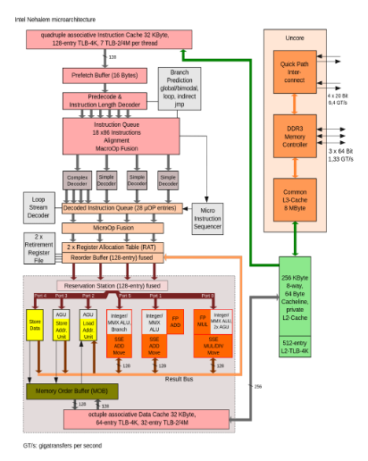

# How a pencil is made

“There is not a single human being who could make a modern pencil from scratch!” This is a bold statement and a true one. A pencil consists of so many parts that there is not a single person in the world who could do it by themselves. There trees which needs to be chopped down for their wood. The wood needs to be cut into smaller pieces and processed in such a way that we can create around 300.000 pencils from a single tree. After that the wood needs to be filled with graphite, the graphite is mixed with clay and baked at about 815 deg C. This graphite is sand-witched between two pieces of our wood, glued and pressed together under a high pressure ensuring that the parts stay together. These proto-pencils are not painted but coated with four to ten layers of lacquer. As a last step we add an eraser, held onto the pencil by a metallic clasp which circles the pencil and holds the gummy substance in place by gently indenting the metal into the wood and the gum. This clasp is set with precision, without breaking the graphite, which is easily broken, and without cracking the wood.

I hope that by now you have realized that it is only possible to make a pencil because of decades of progress and discovery. It took *craftsmen* centuries to acquire the skills and discipline needed to craft the materials and production processes for something as seemingly simple as a pencil.

# How software is made

“There is not a single human being who could create modern software from scratch!” Imagine that we would lose all technology tomorrow. I can write code, I’m fairly good at writing code but I would be nothing without a computer, an IDE and a compiler. The last two I might be able to create given the first, but a computer is not something I can build. If I’m being honest, I don’t even fully understand how a processor works. Let me show you a picture:

Imagine being handed an image like this and being told: “Your sprint backlog has been updated, you will create the *Simple Decoder*.” I would not even know where to start. I’d probably go to a bookstore and get the highest rated book on CPUs; sit down for a week; read as much as I could; think I’d have a grasp on the subject and proceed to create the world’s worst *Simple Decoder*.s

This collaboration is what we are asking of teams. This *specific proficiency* is what we are asking of software engineers. We are asking teams to build a small part of a larger product. Our architectural drawings are the same as the drawing we just saw of the processor. We expect teams to know what the drawing means, what role they play in bringing that drawing to life, all the while being able to steer themselves. What we are asking teams to do, is to: “Create a small part of a pencil in such a way that we can mass produce all these parts, bring them together and sell the complete product to customers.”.

Like in the case with the pencils, we are asking teams to be *craftsmen*. They need to be proficient in the art of creating software for a specific domain. This software will be used by other teams to facilitate our business in automating their processes. To be honest, we are asking a lot of our teams: becoming a *craftsman* takes time.  Nevertheless, once you’re starting to near that pinnacle of professionalism, you would not stop even if you could.

# Craftsmanship

It is difficult to draw a hard line of what an engineer should know and how we, as an organisation, can best guide them. The closest I’ve come to hearing a term for this is *Craftsmanship*. A *Craftsman* does not only excel at their skill but they also know how their skill impacts the world around them. They know what is happening in their field, which problems it is facing and how to help the next generation of *Craftsmen* avoid the mistakes they have made. Being a *Software Craftsman* is not about being good at, for example, “writing code” or “testing code”. It is about being good at “Delivering working software”.

Our community is polarised about what it means to “Deliver working software”. I can help with this debate. I want to postulate that your team is “Delivering working software” when, tomorrow, everyone can leave and the next team will have a minimal ramp-up time to continue their work. It is less about the running software and more about the quality of everything around the running software.

In order to specify the processes which need to be in place to deliver this kind of continuity, debates like: “Should we use Test Driven Development?” or: “Should we adopt pair programming and just check in on the master branch?” stem from. I don’t think there is a single *Craftsman* who denies that testing makes their products better. The debate is not about quality, the debate is about quality compared to speed of delivery. It is a debate which is grounded in the principals that we want to remove superfluous processes. More often than not, to the detrement of the software, managers make decisions which only a true craftsman is able to make.

But, this debate is becoming hypothetical. Imagine that pencil and everyone needed to craft it. Now let’s postulate that tomorrow the experienced people that know how to make graphite quit; all of them! Would we want the production of pencils to stop? No, we’d want them to have trained the next generation of graphite *craftsmen* to take their place.

The same goes for software development. We need every developer to know how to deliver software. We are building code upon code and system upon system. We are hooking everything up to the internet, just because we can, without taking a step back and thinking about the bigger picture of what we’re creating. We’ll need to start accepting that what we create as software developers is going to be used by other software developers for a very long time to come. Realizing this should trigger us to put all our effort into creating the best software we can and to become true *craftsmen.

# The four pillars of craftsmanship

*Craftsmanship* is built on top of four pillars. In this chapter I will describe each pillar in detail.

 * Be curious
 * Educate peers
 * Be disciplined
 * Take ownership

## Be curious

Curiosity is what drives innovation and improvements. If you are fully convinced that what you are doing is the most optimal way to do it and there are no more gains to be achieved; you’ve lost your curiosity. *Craftsmen* are never satisfied. They can be proud, they can be stubborn, they can try to disprove their competition; but they are never satisfied.

Within the concept of curiosity lies a form of hope and this is where I always focus my efforts on. We can detect things which are going wrong but we should never lose hope. Hope drives us to challenge our status quo and forces us to think of new and better ways to do what we are already doing.

With hopefulness comes enthusiasm. Hope is infectious, it spreads; but hope can also be put out. There is the downside to managing curiosity; if you are not careful you can destroy all curiosity leaving only apathy and disgruntled employees.

If you, as a *Craftsman*, feel cornered or afraid, if you are not challenged enough; your hope is the first thing to be put out. If you are held back and not given the opportunity to see where your mind and skills take you, your curiosity will be put out.

It takes time to light the spark of curiosity, it only takes moments to snuff it out.
A craftsman is curious because they are hopeful and are not afraid to share that hope. A craftsman knows how to inspire that curiosity in others, inviting questions, encouraging challenges and rewarding the fruits of genuine curiosity.

## Educate peers

A craftsman understands that their knowledge is limited and that only by collaboration, progress is made. We humans are great at recognizing patterns but not everyone sees the same patterns. This is why education must come from multiple sources. A true craftsman knows where their weaknesses lie and will help their apprentices in finding other craftsmen who will help them fill those gaps, overcome those weaknesses.

I hope you all know the saying: “Standing on the shoulders of giants.” It is true. I have been wrecking my brain to find the opposite of craftsmanship until a colleague of mine proposed *ineptness*, another colleague proposed *legacy*. Both are right, both words fit and both relay something different about craftsmanship.

Education is the only way to combat ineptness and raise someone up from being inept to being a craftsman while interaction is the only way to lift legacy into something new and give hope. It is not only someone’s skill which makes them a craftsman but also their willingness to help their environment achieve new levels.

## Be disciplined

It takes time, even for a *craftsman*, to create something which works well. In our enthusiasm or because of expectations, promisses and pressure, we can forget to apply the proper standards to our work, resulting in something others might find amazing and exceptional but other *craftsmen* immediately recognize as being cobbled together.
Having the discipline to take the time and do something well is what separates a *craftsman* from a novice. 

The best analogy I can think of, is that of a writer. Everyone can write, everyone can string together a few words and hand them to another person hoping that they’ll infer the correct meaning. Only a *craftsman* realizes that it takes discipline to revise and edit, cut and rewrite, until the words on the page are not only covering their intention but also target the right audience and it brings them along until the writer's point is perfectly clear.

Writing something is hard. A true *craftsman* is humble and disciplined enough to realize when their work is not ready yet and will take advice and help until it is.

Back in the realm of software development we have this same analogy by looking at code and pull-requests. Even the best developers should be humble enough to go through the pull-request process, everyone can make mistakes and by showing your code to other developers and being open to feedback and questions, everyone can improve. The added benefit is that the *running software* gets better.

Through discipline and humble interaction, the end-result is improved.

## Take ownership

All this discipline can only be channeled into something productive when you take ownership. If you are acraftsman, if you are curious, have learned from the best, are teaching the next generation and are disciplined; you will *want* to take ownership. You will feel a sense of pride in what your produce.

Ownership is not something you can force on someone. I will not take ownership of something I do not believe in. I will refuse to let someone I feel responsible for, take ownership of something which was created by an individual who lacks the discipline to create it in the correct way. Ownership is the ultimate act of confidence. When you take ownership of something you say: “I believe in this, I will show the world how great it is!”.

My general message to organizations is that it is unwise to *assign* ownership of something. People need to *take* ownership and through the act of taking ownership, promise that they will adhere to their code of conduct, their discipline when working on that topic. We, as an organization, should only allow *craftsmen* to take ownership. If we allow the inept to take ownership we are in for a world of trouble. Their great intentions will set us back more than if we had not created that piece of software in the first place.

# Conclusion

Software, like pencils, can only be developed, improved an brought to the next level thanks to *Craftsmen*. *Craftsmanship* is the process of rigorously applying discipline to a problem until you are proud of the result and are willing to take ownership of that result. A *craftsmen* realizes that they cannot do it alone and will actively seek out, learn from and train other people. They will collaborate with their peers until there is a community of like-minded *craftsmen* challenging each other and continuously improving each other.

A *craftsman* realizes that they are not the alpha and the omega of a topic. They realize that they, purely by the fact that they came before, will be one of the shoulders on which the next generation will stand. A *craftsman* is content in the fact that their skills, their discipline and their teaching will move their field forward.

I am a technical fellow at Essent. I teach, I train and I help. My role is as much a detector of ineptness as it is an instigator of improvements through interaction. I take this seriously but I realize that I am not at the center of our journey towards *craftsmanship*. For me, being a technical fellow is about embodying the four pillars of *craftsmanship* and with my effort inspire the next generation of incredible engineers at Essent.

If you have any comments or want to participate in the discussion, please join us 
at [We all have a role to play](https://www.reddit.com/r/Essent_IT/comments/uwpfiw/we_all_have_a_role_to_play/),
see you there!